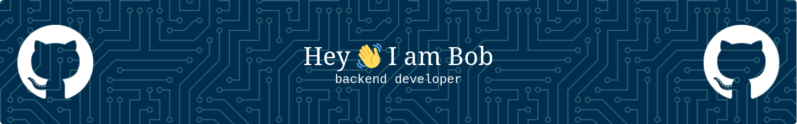

# 💫 About Me:

I'm a passionate backend/fullstack developer.  🔭 I’m currently working on a RAG application  🧠 I’m currently learning Rust frontend development  💬 Ask me about analog photography  ⚡ Fun fact: I prefer tabs over spaces but still use spaces (thanks `gofmt`/`rustfmt`) 

## 🌐 Socials:

 

# 💻 Tech Stack:

                        

<!-- Proudly created with GPRM ( https://gprm.itsvg.in ) -->
