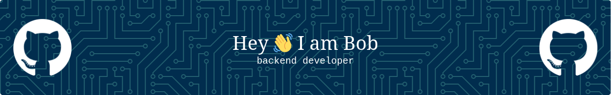

# 💫About Me :
I'm a passionate backend/fullstack developer.

🔭 I’m currently working on high-performance aggregation platform 
🧠 I’m currently learning Rust 
💬 Ask me about analog photography 
⚡ Fun fact: I prefer tabs over spaces but still use spaces (thanks `gofmt`) 

## 🌐Socials

# 💻Tech Stack
                
# 📊GitHub Stats :

### ✍️Random Dev Quote

---

  ## 💰You can help me by Donating
  

  <!-- Proudly created with GPRM ( https://gprm.itsvg.in ) -->
